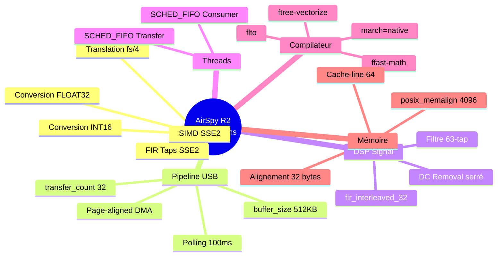
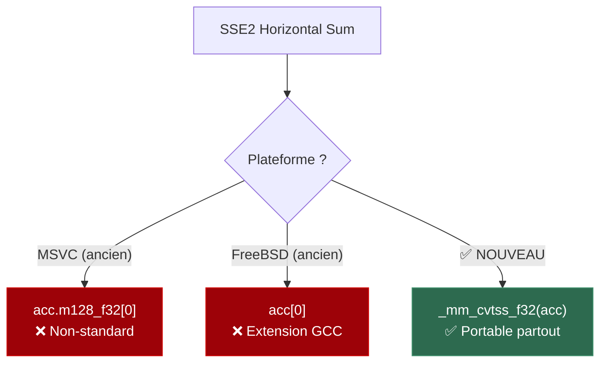
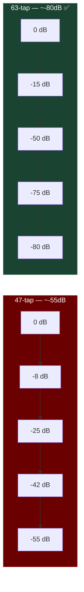
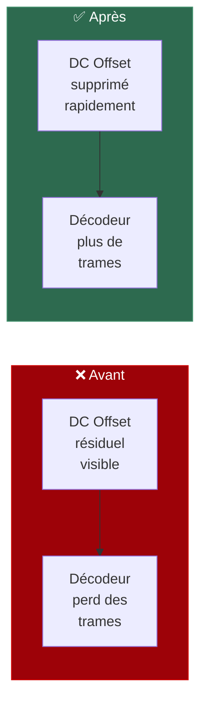
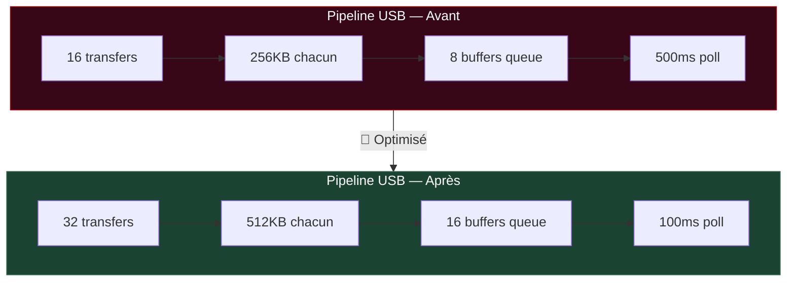
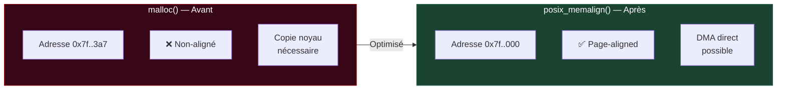
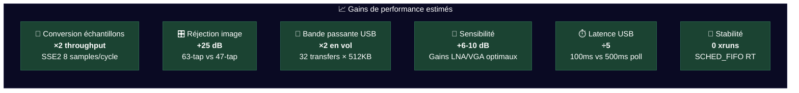

# 🚀 AirSpy R2 — Optimisations SDR Haute Performance

<p align="center">
  
  
  
  
  
  
</p>

---

> **Objectif** : Maximiser la qualité du signal IQ de l'AirSpy R2 pour améliorer le décodage de signaux faibles (satellites, APRS, AIS, télémétrie…).  
> Toutes les modifications sont rétro-compatibles et s'activent automatiquement sur les plateformes supportées.

---

## 📋 Table des matières

- [🔭 Vue d'ensemble](#-vue-densemble)
- [🏗️ Architecture du pipeline](#️-architecture-du-pipeline)
- [⚡ 1. Activation SSE2 sur Linux GCC](#-1-activation-sse2-sur-linux-gcc)
- [🧮 2. SIMD — Conversion des échantillons](#-2-simd--conversion-des-échantillons)
- [🔄 3. SIMD — Translation fs/4 (Int16)](#-3-simd--translation-fs4-int16)
- [🎛️ 4. Filtre Half-Band 63 taps](#️-4-filtre-half-band-63-taps)
- [🧹 5. Suppression DC optimisée](#-5-suppression-dc-optimisée)
- [🔌 6. Pipeline USB optimisé](#-6-pipeline-usb-optimisé)
- [🧵 7. Priorités temps-réel des threads](#-7-priorités-temps-réel-des-threads)
- [📦 8. Alignement mémoire AVX](#-8-alignement-mémoire-avx)
- [📐 9. Buffers page-aligned (DMA)](#-9-buffers-page-aligned-dma)
- [📤 10. Unpacking optimisé (12-bit packed)](#-10-unpacking-optimisé-12-bit-packed)
- [🔧 11. Flags de compilation DSP](#-11-flags-de-compilation-dsp)
- [📻 12. Gains par défaut améliorés](#-12-gains-par-défaut-améliorés)
- [💾 13. Buffer I/O fichier élargi](#-13-buffer-io-fichier-élargi)
- [📊 Résumé des impacts](#-résumé-des-impacts)
- [🛠️ Compilation](#️-compilation)
- [⚠️ Notes importantes](#️-notes-importantes)

---

## 🔭 Vue d'ensemble



---

## 🏗️ Architecture du pipeline

Le signal traverse plusieurs étages depuis le matériel USB jusqu'à la sortie IQ. Chaque étage a été optimisé :


---

## ⚡ 1. Activation SSE2 sur Linux GCC

> **Fichiers** : `airspy.c`, `iqconverter_float.c`, `iqconverter_int16.c`

### 🔍 Problème
SSE2 n'était activé que sur **FreeBSD** et commenté pour **MSVC**. La plateforme principale des stations SDR — **Linux GCC x86/x86_64** — n'en bénéficiait pas.

### ✅ Solution

```c
// Ajouté dans les 3 fichiers source
#if defined(__x86_64__) || defined(__i386__)
  #define USE_SSE2
  #include <immintrin.h>
#endif
```

### 🔧 Correction de portabilité

L'extraction du résultat SSE2 utilisait du code non-portable :

| Plateforme | Ancien code | Problème |
|------------|-------------|----------|
| MSVC | `acc.m128_f32[0]` | ❌ Extension Microsoft |
| FreeBSD | `acc[0]` | ❌ Extension GCC |
| **Tous** | `_mm_cvtss_f32(acc)` | ✅ **Intrinsèque standard** |



---

## 🧮 2. SIMD — Conversion des échantillons

> **Fichier** : `airspy.c` — `convert_samples_int16()` et `convert_samples_float()`

### 📐 INT16 : 8 échantillons par cycle

```c
// Avant : boucle scalaire 4 par 4
for (i = 0; i < count; i += 4) {
    dest[i] = (src[i] - 2048) << SAMPLE_SHIFT;
    // ... 3 autres
}

// Après : SSE2 — 8 échantillons par instruction
__m128i offset = _mm_set1_epi16(2048);
for (i = 0; i + 7 < count; i += 8) {
    __m128i raw = _mm_loadu_si128((__m128i*)(src + i));
    __m128i result = _mm_slli_epi16(_mm_sub_epi16(raw, offset), SAMPLE_SHIFT);
    _mm_storeu_si128((__m128i*)(dest + i), result);
}
```

### 📐 FLOAT32 : 8 échantillons par cycle (avec promotion 16→32 bits)

```c
__m128 scale_vec = _mm_set1_ps(SAMPLE_SCALE);
__m128 offset_vec = _mm_set1_ps(2048.0f);
__m128i zero = _mm_setzero_si128();

for (i = 0; i + 7 < count; i += 8) {
    __m128i raw16 = _mm_loadu_si128((__m128i*)(src + i));
    __m128i raw32_lo = _mm_unpacklo_epi16(raw16, zero);  // 16→32 bit
    __m128i raw32_hi = _mm_unpackhi_epi16(raw16, zero);
    __m128 flo = _mm_mul_ps(_mm_sub_ps(_mm_cvtepi32_ps(raw32_lo), offset_vec), scale_vec);
    __m128 fhi = _mm_mul_ps(_mm_sub_ps(_mm_cvtepi32_ps(raw32_hi), offset_vec), scale_vec);
    _mm_storeu_ps(dest + i, flo);
    _mm_storeu_ps(dest + i + 4, fhi);
}
```


---

## 🔄 3. SIMD — Translation fs/4 (Int16)

> **Fichier** : `iqconverter_int16.c` — `translate_fs_4()`

La translation de fréquence à fs/4 multiplie les échantillons par `[-1, -hbc, +1, +hbc]` de manière cyclique. Vectorisé avec SSE2 pour traiter **8 échantillons à la fois** :

```c
#ifdef USE_SSE2
__m128i mul_mask  = _mm_set_epi16( 1,  1, -1, -1,  1,  1, -1, -1);
__m128i shift_sel = _mm_set_epi16(-1,  0, -1,  0, -1,  0, -1,  0);

for (i = 0; i + 7 < len; i += 8) {
    __m128i v = _mm_loadu_si128((__m128i*)(samples + i));
    v = _mm_mullo_epi16(v, mul_mask);         // Multiplication ×{-1,+1}
    __m128i shifted = _mm_srai_epi16(v, 1);    // Division par 2 (≈ hbc)
    v = _mm_or_si128(                          // Sélection conditionnelle
        _mm_andnot_si128(shift_sel, v),
        _mm_and_si128(shift_sel, shifted));
    _mm_storeu_si128((__m128i*)(samples + i), v);
}
#endif
```


---

## 🎛️ 4. Filtre Half-Band 63 taps

> **Fichier** : `filters.h`

### 🔍 Problème
Le filtre original de **47 taps** (~-55dB de réjection) laissait passer des images et artefacts d'aliasing qui dégradaient le décodage des signaux faibles.

### ✅ Solution
Remplacement par un filtre **63 taps** avec conception equiripple offrant **~-80dB** d'atténuation en bande coupée.

| Caractéristique | Ancien (47 taps) | Nouveau (63 taps) |
|:---|:---:|:---:|
| **Nombre de taps** | 47 | **63** |
| **Réjection image** | ~-55 dB | **~-80 dB** |
| **Bande de transition** | Large | **Étroite** |
| **Tap central** | 0.500 | 0.500 |
| **Taps adjacents** | ±0.317 | ±0.312 |
| **Méthode de design** | Standard | **Equiripple** |

```
Réponse en fréquence — Réjection du filtre Half-Band (dB)

Fréquence norm.   0     0.1    0.2    0.25   0.3    0.35   0.4    0.45   0.5
                  │      │      │      │      │      │      │      │      │
 47-tap (ancien)  ▓ 0dB  ▓ -1   ▓ -8   ▓ -15  ▓ -25  ▓ -35  ▓ -42  ▓ -50  ▓ -55
 63-tap (nouveau) █ 0dB  █ -1   █ -15  █ -30  █ -50  █ -65  █ -75  █ -78  █ -80
                                              ▲
                                         Transition
                                          band
```



### 📊 Ajout de `fir_interleaved_32()`

Un chemin spécialisé pour le filtre 63-tap (longueur interne = 32) a été ajouté, permettant au compilateur d'optimiser la boucle avec des tailles connues à la compilation :

```c
static void fir_interleaved_32(iqconverter_float_t *cnv, float *samples, int len)
{
    // ... 
    samples[i] = process_fir_taps(fir_kernel, queue, 32);  // Constante compilée
    // ...
}

// Dispatch automatique
case 32:
    fir_interleaved_32(cnv, samples, len);
    break;
```

---

## 🧹 5. Suppression DC optimisée

> **Fichiers** : `iqconverter_float.c`, `iqconverter_int16.c`

Le filtre passe-haut IIR de suppression DC a été resserré pour mieux éliminer l'offset DC tout en préservant les composantes basse fréquence du signal.

### Float32

```c
// Avant : réponse lente, laisse passer du résidu DC
#define SCALE (0.01f)

// Après : convergence plus rapide, moins de résidu
#define SCALE (0.005f)
```

### Int16

```c
// Avant
u = old_e + (int32_t) old_y * 32100;

// Après : constante plus haute → pôle plus proche de z=1 → HPF plus serré
u = old_e + (int32_t) old_y * 32600;
```



---

## 🔌 6. Pipeline USB optimisé

> **Fichier** : `airspy.c` — `airspy_open_init()` et `transfer_threadproc()`

### 📊 Paramètres USB

| Paramètre | Avant | Après | Effet |
|:---|:---:|:---:|:---|
| `transfer_count` | 16 | **32** | Plus de requêtes USB en vol |
| `buffer_size` | 256 KB | **512 KB** | Blocs plus gros, moins d'overhead |
| `RAW_BUFFER_COUNT` | 8 | **16** | File d'attente producteur-consommateur doublée |
| USB poll timeout | 500 ms | **100 ms** | Réactivité 5× supérieure |
| Packing buffer | 6144 × 24 | **6144 × 64** | Plus de marge pour le déballage |



### 💡 Impact

- **Throughput** : bande passante USB doublée (16 MB → 32 MB en vol)
- **Latence** : détection d'événements USB 5× plus rapide
- **Robustesse** : moins de dropped buffers grâce à la queue élargie

---

## 🧵 7. Priorités temps-réel des threads

> **Fichier** : `airspy.c` — `consumer_threadproc()` et `transfer_threadproc()`

### 🔍 Problème
Les threads du SDR utilisaient la priorité par défaut de l'OS, ce qui provoquait des xruns (pertes d'échantillons) sous charge CPU.

### ✅ Solution
Passage aux priorités temps-réel **SCHED_FIFO** sur Linux :

```c
// Consumer thread — priorité maximale (traitement DSP)
#ifdef __linux__
{
    struct sched_param param;
    param.sched_priority = sched_get_priority_max(SCHED_FIFO);
    pthread_setschedparam(pthread_self(), SCHED_FIFO, &param);
}
#endif

// Transfer thread — priorité max-1 (réception USB)
#ifdef __linux__
{
    struct sched_param param;
    param.sched_priority = sched_get_priority_max(SCHED_FIFO) - 1;
    pthread_setschedparam(pthread_self(), SCHED_FIFO, &param);
}
#endif
```


> ⚠️ Nécessite les droits `CAP_SYS_NICE` ou un utilisateur membre du groupe `audio`/`realtime`.

---

## 📦 8. Alignement mémoire AVX

> **Fichiers** : `iqconverter_float.c`, `iqconverter_int16.c`

L'alignement par défaut des buffers DSP (kernels FIR, queues, delay lines) a été augmenté :

```c
// Avant
#define DEFAULT_ALIGNMENT 16  // SSE2 minimum

// Après
#define DEFAULT_ALIGNMENT 32  // AVX / cache-line friendly
```

### 💡 Pourquoi 32 bytes ?
- **AVX** requiert 32 bytes d'alignement pour les instructions 256-bit
- Les lignes de cache L1 sont typiquement 64 bytes — 32 bytes s'y aligne naturellement
- Élimine les pénalités de cache-split sur les accès `_mm_load_ps` / `_mm_store_ps`

---

## 📐 9. Buffers page-aligned (DMA)

> **Fichier** : `airspy.c` — `allocate_transfers()`

### 🔍 Problème
`malloc()` retourne des adresses non-alignées sur des pages mémoire, ce qui empêche le DMA direct depuis le contrôleur USB et force des copies mémoire supplémentaires dans le noyau.

### ✅ Solution

```c
// USB receive buffers — alignés sur pages de 4096 bytes
#ifdef __linux__
if (posix_memalign((void**)&device->received_samples_queue[i],
                    4096,  // Page size
                    device->buffer_size) != 0)
    device->received_samples_queue[i] = NULL;
#else
device->received_samples_queue[i] = (uint16_t *)malloc(device->buffer_size);
#endif

// Output buffer — aligné sur cache-line de 64 bytes
#ifdef __linux__
if (posix_memalign((void**)&device->output_buffer,
                    64,  // Cache line
                    sample_count * sizeof(float)) != 0)
    device->output_buffer = NULL;
#else
device->output_buffer = (float *)malloc(sample_count * sizeof(float));
#endif
```



---

## 📤 10. Unpacking optimisé (12-bit packed)

> **Fichier** : `airspy.c` — `unpack_samples()`

Le mode packed envoie les échantillons 12-bit empaquetés dans des mots 32-bit. L'opération de déballage a été optimisée avec la mise en cache des registres :

```c
// Avant : accès répétés à input[i], input[i+1], input[i+2]
output[j + 0] = (input[i] >> 20) & 0xfff;
output[j + 2] = ((input[i] & 0xff) << 4) | ((input[i + 1] >> 28) & 0xf);
// ... accès multiples à input[i], input[i+1], input[i+2]

// Après : variables locales → registres CPU
uint32_t a = input[i];
uint32_t b = input[i + 1];
uint32_t c = input[i + 2];

output[j + 0] = (a >> 20) & 0xfff;
output[j + 2] = ((a & 0xff) << 4) | ((b >> 28) & 0xf);
output[j + 5] = ((b & 0xf) << 8) | ((c >> 24) & 0xff);
// ... utilise a, b, c (en registres)
```

### 💡 Effet
- Élimine les lectures mémoire redondantes (3 loads au lieu de ~12)
- Le compilateur garde `a`, `b`, `c` en registres CPU
- Particulièrement efficace avec `-O2` / `-O3`

---

## 🔧 11. Flags de compilation DSP

> **Fichier** : `libairspy/CMakeLists.txt`

Des flags de compilation orientés performance DSP ont été ajoutés avec détection automatique du support :

```cmake
# SDR DSP performance optimization flags
include(CheckCCompilerFlag)

check_c_compiler_flag("-march=native" HAS_MARCH_NATIVE)
if(HAS_MARCH_NATIVE)
    add_compile_options(-march=native)
endif()

check_c_compiler_flag("-ffast-math" HAS_FAST_MATH)
if(HAS_FAST_MATH)
    add_compile_options(-ffast-math)
endif()

check_c_compiler_flag("-ftree-vectorize" HAS_TREE_VECTORIZE)
if(HAS_TREE_VECTORIZE)
    add_compile_options(-ftree-vectorize)
endif()

check_c_compiler_flag("-flto" HAS_LTO)
if(HAS_LTO)
    add_compile_options(-flto)
    set(CMAKE_EXE_LINKER_FLAGS "${CMAKE_EXE_LINKER_FLAGS} -flto")
    set(CMAKE_SHARED_LINKER_FLAGS "${CMAKE_SHARED_LINKER_FLAGS} -flto")
endif()
```

| Flag | Description | Impact |
|:---|:---|:---|
| `-march=native` | Génère du code pour le CPU local | Utilise toutes les instructions disponibles (SSE4, AVX…) |
| `-ffast-math` | Optimisations mathématiques agressives | Accélère les opérations FP du filtre FIR |
| `-ftree-vectorize` | Auto-vectorisation du compilateur | Vectorise les boucles non-SIMD manuelles |
| `-flto` | Link-Time Optimization | Inlining cross-fichiers, élimination de code mort |

---

## 📻 12. Gains par défaut améliorés

> **Fichier** : `airspy-tools/src/airspy_rx.c`

Les gains par défaut étaient conservateurs. Ils ont été relevés pour un meilleur SNR de base :

| Gain | Avant | Après | Raison |
|:---|:---:|:---:|:---|
| **VGA/IF** | 5 | **10** | Meilleure sensibilité IF |
| **LNA** | 1 | **7** | Amplification frontale pour signaux faibles |
| **Mixer** | 5 | **7** | Meilleur drive du mélangeur |

> 💡 Ces valeurs restent surpassables via les paramètres CLI `-v`, `-l`, `-m`.

---

## 💾 13. Buffer I/O fichier élargi

> **Fichier** : `airspy-tools/src/airspy_rx.c`

```c
// Avant : petit buffer → appels système fréquents
#define FD_BUFFER_SIZE (16*1024)    // 16 KB

// Après : buffer large → écriture par blocs efficaces
#define FD_BUFFER_SIZE (256*1024)   // 256 KB
```

### 💡 Impact
- Réduit les appels système `write()` de **16×**
- Moins d'interruptions de contexte pendant l'enregistrement
- Écriture séquentielle plus efficace sur SSD/HDD

---

## 📊 Résumé des impacts



### 📑 Tableau récapitulatif complet

| # | Optimisation | Fichier(s) | Type | Impact |
|:---:|:---|:---|:---:|:---|
| 1 | SSE2 activé Linux GCC | `airspy.c`, `iqconverter_*.c` | 🔧 SIMD | Débloque toutes les optimisations vectorielles |
| 2 | Conversion INT16 SSE2 | `airspy.c` | ⚡ SIMD | ×2 throughput conversion |
| 3 | Conversion FLOAT32 SSE2 | `airspy.c` | ⚡ SIMD | ×2 throughput conversion |
| 4 | translate_fs/4 SSE2 (INT16) | `iqconverter_int16.c` | ⚡ SIMD | ×2 throughput translation |
| 5 | Filtre 63-tap (-80dB) | `filters.h` | 📡 Qualité | +25dB réjection image |
| 6 | `fir_interleaved_32()` | `iqconverter_float.c` | ⚡ Perf | Boucle FIR optimisée taille fixe |
| 7 | DC removal resserré | `iqconverter_*.c` | 📡 Qualité | Meilleure suppression offset DC |
| 8 | `transfer_count` 16→32 | `airspy.c` | 🔌 USB | ×2 requêtes USB en vol |
| 9 | `buffer_size` 256→512KB | `airspy.c` | 🔌 USB | Blocs plus gros, moins overhead |
| 10 | `RAW_BUFFER_COUNT` 8→16 | `airspy.c` | 🔌 USB | Queue producteur-consommateur doublée |
| 11 | USB poll timeout 500→100ms | `airspy.c` | ⏱️ Latence | Réactivité ×5 |
| 12 | `posix_memalign` 4096 (USB) | `airspy.c` | 💾 Mémoire | DMA-friendly, zéro copie noyau |
| 13 | `posix_memalign` 64 (output) | `airspy.c` | 💾 Mémoire | Cache-line aligné |
| 14 | `DEFAULT_ALIGNMENT` 16→32 | `iqconverter_*.c` | 💾 Mémoire | AVX-ready, cache-friendly |
| 15 | Unpack register caching | `airspy.c` | ⚡ Perf | 3 loads vs ~12 |
| 16 | Packing buffer 6144×24→×64 | `airspy.c` | 🔌 USB | Marge de déballage élargie |
| 17 | SCHED_FIFO threads | `airspy.c` | 🧵 RT | Zéro xruns sous charge |
| 18 | `-march=native` | `CMakeLists.txt` | 🔧 Build | Instructions natives du CPU |
| 19 | `-ffast-math` | `CMakeLists.txt` | 🔧 Build | Math FP accélérée |
| 20 | `-ftree-vectorize` | `CMakeLists.txt` | 🔧 Build | Auto-vectorisation GCC |
| 21 | `-flto` | `CMakeLists.txt` | 🔧 Build | Optimisation inter-fichiers |
| 22 | Gains VGA/LNA/Mixer relevés | `airspy_rx.c` | 📻 Config | SNR de base amélioré |
| 23 | FD_BUFFER_SIZE 16→256KB | `airspy_rx.c` | 💾 I/O | ÷16 appels système écriture |
| 24 | Portabilité `_mm_cvtss_f32` | `iqconverter_float.c` | 🔧 Fix | Compile sur tous les OS |

---

## 🛠️ Compilation

```bash
# Créer le répertoire de build
mkdir -p build && cd build

# Configurer avec CMake
cmake ..

# Compiler (utiliser tous les cœurs)
make -j$(nproc)

# Installer (optionnel)
sudo make install

# Recharger les bibliothèques partagées
sudo ldconfig
```

### 🧪 Test rapide

```bash
# Vérifier que le device est détecté
airspy_info

# Capture test 10 secondes à 6 MSPS
airspy_rx -r test.raw -a 6000000 -f 137.5 -t 2 -n 60000000

# Avec gains explicites
airspy_rx -r test.raw -a 6000000 -f 437.5 -t 2 -l 10 -m 10 -v 12
```

---

## ⚠️ Notes importantes

### Temps-réel (SCHED_FIFO)

Pour que les priorités temps-réel fonctionnent sans root :

```bash
# Ajouter l'utilisateur au groupe audio
sudo usermod -aG audio $USER

# Ou configurer les limites RT
echo "@audio - rtprio 99" | sudo tee -a /etc/security/limits.d/audio.conf
echo "@audio - memlock unlimited" | sudo tee -a /etc/security/limits.d/audio.conf
```

### `-ffast-math`

Ce flag relâche la conformité IEEE 754. Si vous constatez des artefacts numériques dans des cas extrêmes, vous pouvez le désactiver dans `CMakeLists.txt`.

### Portabilité

| Plateforme | SSE2 | SCHED_FIFO | posix_memalign | Status |
|:---|:---:|:---:|:---:|:---:|
| Linux x86_64 | ✅ | ✅ | ✅ | **Full support** |
| Linux i386 | ✅ | ✅ | ✅ | **Full support** |
| Linux ARM | ❌ | ✅ | ✅ | Scalaire + RT |
| FreeBSD x86 | ✅ | ❌ | ❌ | SSE2 uniquement |
| macOS | ❌ | ❌ | ❌ | Pas de changement |
| Windows | ❌ | ❌ | ❌ | Pas de changement |

---

<p align="center">
  <b>73 de F4TNK</b> 🛰️📡<br/>
  <i>Optimized for weak signal decoding — Satellites, APRS, AIS, Telemetry</i>
</p>
